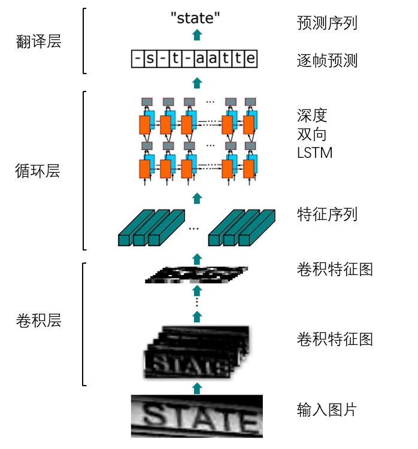
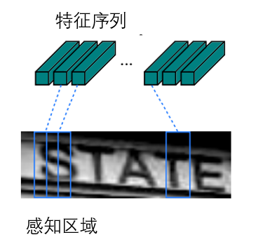
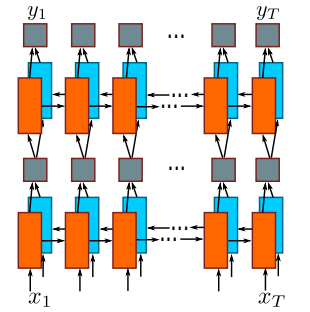

# OCR 论文

翻译自: [An End-to-End Trainable Neural Network for Image-based Sequence Recognition and Its Application to Scene Text Recognition](https://arxiv.org/abs/1507.05717).

原作者: Baoguang Shi, Xiang Bai and Cong Yao
School of Electronic Information and Communications
Huazhong University of Science and Technology, Wuhan, China

翻译人员:LazyCat

完成时间:

校对:LazyCat

**(本人英语能力有限,如有错误请见谅!)**

## 摘要

基于图像的序列识别一直是计算机视觉的一项长久的研究话题.在本论文中,我们探讨了场景文本识别的问题所在.它在基于图像的序列识别问题中是一个最重要,也最富有挑战性的任务.

我们提出了一个崭新的神经网络架构,它整合了特征提取和序列建模,将它们转换为了一个统一的框架.对比之前的场景文字识别系统,我们提出的这个架构有如下四个不同的特性:

- 它是端到端训练的.不同于大多数现成的算法,这些算法的不同组件需要单独训练和调整.
- 它可以很自然地处理不同长度的序列.不涉及字符分割和水平尺度归一化.
- 它不局限于任何已经定义好的词典.不论是在无词典还是有词典的场景文字识别任务中,它都表现地非常好.
- 它训练出来的模型更加轻量但是非常有效.这在实际应用场景中更加有用.

在标准的基准上进行的一些实验,包括IIIT-5K,街道文字识别和ICDAR数据集,都证明了在现有技术之上此算法的优越性.另外,此算法在基于图像的乐谱识别任务中表现地很好.这明显地验证了它的通用性.

## 1.介绍

最近,社区见证了神经网络的强势复兴.这主要是受到深度神经网络模型成功的刺激.特别是深度卷积神经网络(DCNN)在不同视觉任务上的成功.然而,这些网络主要都致力于解决检测和对象类别分类问题.

在这篇论文中,我们关心另外一个计算机视觉的经典问题:基于图像的序列识别.

在实际世界中,稳定的视觉对象,例如科学文章,手写体和乐谱,很多都倾向于以序列的方式出现,而不是孤立的.不同于一般的对象识别,识别这样的"类序列对象"(sequence-like objects)通常需要系统去预测一系列的标签,而不是单一的标签.因此,对这些对象的识别可以被自然地看作是序列识别问题.

类序列对象的另外一个特别的属性是,它们的长度可能完全不一样.例如,英语单词可以包含两个字符例如"OK",也可以包含15个字符例如"congratulations".所以,最出名的深度模型例如DCNN不可以直接应用于序列检测,因为DCNN模型通常在维度固定的输入和输出上运行,因此它对于产生长度可变的序列是无能为力的.

已经有人做了一些尝试去解决这种特定的类序列对象的识别问题.例如[35, 8]()中的算法先检测出单一的字符,然后用DCNN模型(使用标签好的字符图片训练的)去识别这些检测到的字符.这样的模型通常需要训练出一个强大的字符检测器来精确地检测并从原始图片中裁剪出每个字符.另外一个尝试是把场景图像识别看作成一个图像分类问题,并为每个类别标签分配一个英文单词(一共有90K个单词).它产生了一个巨大的训练好的模型和海量标签.这样的做法很难去识别那些除了英文以外的其它类型的类序列对象,例如中文,乐谱等.因为这种序列的基础组合数量可以高达上百万.总之,目前这些基于DCNN的系统不可以直接被用来进行基于图像的序列识别.

循环神经网络模型(RNN),是深度神经网络家族中的另外一个重要的分支,它主要是被设计用来处理序列的.RNN的一个优势是不管在训练还是测试的时候,它都不需要知道每个元素在序列图片对象中的位置.但是通常需要将输入图片对象转换为一个图片特征序列的预处理步骤.例如Graves从手写文本图片中提取了一组几何或图像特征,而Su和Lu将单词图像转换为连续的HOG特征.在这种处理流中,预处理步骤独立于随后的组件.因此现存的基于RNN的系统无法实现端到端的训练和优化.

几种不基于神经网络的传统场景文字识别方法同样对这个领域带来了富有见地的想法和新颖的表现.例如,Almazan和Rodriguez-Serrano提出将字母图片和文本字符串嵌入在一个共同的矢量子空间内.这样单词识别就被转换为了一个检索问题.Yao和Gordo使用中级特征进行场景文本识别.这些方法基本都优于之前基于神经网络的算法,以及本文提出的方法,尽管它们(这里指基于神经网络的算法和本文提出的算法,译者注)在标准基准上表现得很好.

这篇论文的主要贡献是一个新的神经网络模型.这个模型是专门被设计用来识别图像中的类序列对象.这个提出的神经网络模型叫做**卷积循环神经网络**(Convolutional Recurrent Neural Network, CRNN),因为它是DCNN和RNN的组合.对于类序列对象识别,CRNN和传统的神经网络模型相比,有如下几个独特的优势:

- 它可以直接从序列标签中学习(例如,多个单词),不需要详细的注释(例如,多个字符).
- 在直接学习来自图片的信息表示上,它拥有和DCNN同样的特性.既不需要手动提取特征也不需要预处理过程,包括二值化/分割,组件定位等.
- 它拥有和RNN的同样特征,能够产生一系列标签.
- 它不受类序列对象长度的约束,仅需要在训练和测试阶段的高度归一化.
- 和现有的技术相比,它在场景文本(单词识别)有着更出色和更有竞争力的表现.
- 它的参数比传统的DCNN要少得多,占用更少的储存空间.

## 2.网络结构

CRNN的网络结构图如下所示:

图1:

网络从底部到顶部由3个组件组成:卷积层,循环层和一个转录层.

在CRNN的底部,卷积层从每个输入图片中自动提取出一个特征序列.在卷积网络的上面,一个循环网络被构建用来对每一帧的特征序列做出预测.在CRNN的顶部,转录层被用来把逐帧的来自循环层的预测转换为一个标签序列.虽然CRNN是由不同的网络架构(CNN和RNN)组成的,但是它可以在一个共同的损失函数上训练.

### 2.1 特征序列提取

在CRNN模型中,卷积层组件是用来自标准CNN模型的卷积层(convolutional layer)和最大池化层(max-pooling layer)构建的(全连接层被移除了).这个组件被用来提取来自输入图片的特征序列.在把图片输入网络之前,所有图片必须被缩放成相同的高度,接着一个特征序列向量就被从卷积层组件提供的特征图中提取了出来.这个向量是循环层的输入.特别地,每个特征序列中的特征向量是从特征图中从按照列左到右生成的.这意味第i个特征向量是和所有图中的第i列并列的.我们假设每一列的宽度固定为单个像素.

由于卷积,最大池化和元素激活函数在局部区域上运行,它们具有平移不变性.因此,特征图的每一列对应于原始图像中的一个矩形区域(被称为感知区域),并且这些矩形区域从左到右的顺序和特征图中对应的列的从左到右的顺序是一样的,如下图所示:

图2:

深度卷积特征是如此的强大,丰富和可训练的,它已经被广泛用于各种视觉识别任务.一些先前的方法已经使用CNN来学习类序列对象(例如场景文本)的鲁棒表示.然而,这些方法通常使用CNN提取图片的整体特征,然后再收集局部深层特征来识别类序列对象的每个分量.因为CNN要求输入图片被缩放为一个固定的尺寸来满足它固定的输入维度,这对于长度变化很大的类序列对象来说并不合适.在CRNN中,我们将深度特征表达为顺序表示,使得其在类序列对象的长度改变中保持不变.

### 2.2 序列标记

一个深度双向循环网络被构建在卷积层的上方,作为循环层.循环层对每一来自特征序列$\mathbf{x}=x_1,\dots,x_T$的帧$x_t$,都给出一个标签分量$y_t$.循环层有着三方面的优势:

- RNN有着从序列中提取上下文信息的强大能力.在基于图像的序列识别中使用上下文线索比单独地处理每个符号更加的稳定和有用.以场景文本识别为例,宽字符可能需要连续的多个帧来表示.此外,在观察它们的前后关系后,一些模棱两可的字符可以更容易地去区分.例如,要区分"il"中的"i"和"l",把它们放在一起按照高度区分比把它们分开要容易得多.
- RNN可以将误差反向传播到其输入,即卷积层.这允许我们在一个统一的网络中同时训练循环层和卷积层.
- RNN能够对任意长度的序列进行操作,从序列头到尾进行遍历.

一个传统的RNN单元在输入和输出层之间有自连接的隐藏层.每个时间点它接收序列中的一帧$x_t$,它使用一个接收当前输入$x_t$和上一个状态$h_{t-1}$的非线性函数$h_t=g(x_t,h_{t-1})$来更新其内部状态$h_t$.输出$y_t$是基于$h_t$的.这样,之前的上下文$\lbrace x_{t'}\rbrace_{t'\lt t}$被捕获并影响到预测.然而,传统的RNN单元,饱受梯度消失问题的影响,这限制了它能储存的上下文信息,并增加了训练的负担.长短期记忆(LSTM)是另外一种RNN单元,它被专门用来解决这个问题.一个LSTM单元如下图所示:

图3:

一个LSTM单元包含了一个记忆单元和三个门,叫做输入,输出和遗忘门.理论上,记忆单元储存了之前的上下文,而输入和输出门允许单元储存一些非常久远的上下文.与此同时,单元中的记忆可以被遗忘门清除一部分.这种特殊的LSTM单元设计让它能储存一些长久的依赖,这经常出现在基于图像的序列中.

LSTM是定向的,它仅用了以前的上下文.然而,在基于图像的队列中,来自各个方向的上下文都是有用的并且是互相补充的.因此,我们拼接并结合了两个LSTM,一个向前传播一个向后传播.这就变成了一个双向LSTM单元.此外,多个双向LSTM单元可以被堆叠在一起,形成了一个深度双向LSTM,如下图所示:

图4:

深度结构比单层LSTM拥有更高级别的抽象能力,并且在语音识别任务的表现上有重大的改进.

在循环层中,误差往上图中箭头的反方向传播,即基于时间的反向传播(BPTT).在循环层的底部,传播而来的序列误差被连接成为了一张图,反转将特征图转换为特征序列的操作,让误差反馈到卷积层.在实践中,我们会构造一个定制的网络层,叫做"图到序列".它作为连接卷积层和循环层的桥梁.

### 2.3 转录

转录就是将RNN输出的每帧预测结果转换为标签序列的过程.从数学的角度来说,转录就是去寻找一个以每一帧预测作为条件的概率最高的标签序列.在实践中,存在两种转录的模式,叫做无词典和有词典转录.词典就是一个约束预测的标签集合.例如,一个检查拼写的字典.在无词典模式下,预测的产生不受任何字典的约束.在有词典模式下,预测是从字典中选取概率最高的标签.

#### 2.3.1 标签序列的概率

我们采用定义在联结主义时间分类(CTC)层中的条件概率作为标签序列的概率.这个概率是预测标签序列$\mathbf{l}$在给出每帧的预测$\mathbf{y}=y_1,\dots,y_T$的条件下的条件概率.它忽视了每个标签在$\mathbf{l}$中的位置.所以,当我们使用最小化负对数似然作为目标去训练网络的时候,我们仅需要图片和它们的相对标签序列,这避免了标记每个字符的位置.

下面简单地描述计算这个条件概率的公式.输入是一个序列$\mathbf{y}=y_1,\dots,y_T$.其中$T$表示序列的长度.在此处,每个$y_t\in \mathbb{R}^{|\mathcal{L}'|}$是一个在集合$\mathcal{L}'=\mathcal{L}\ \cup n$之上的概率分布.其中$\mathcal{L}$包含了所有在任务中的标签(例如,所有英文字母),加上一个表示"空白"的标签($n$).另外在序列$\pi\in\mathcal{L}'^T$上定义一个序列到序列的映射函数$\mathcal{B}$,其中$T$表示序列的长度.$\mathcal{B}$把$\pi$映射成为$\mathbf{l}$,它首先移除重复的标签,然后移除"空白"标签.例如,$\mathcal{B}$把"--hh-e-l-ll-oo--"('-'表示'空白').映射为"hello".随后,条件概率被定义为所有$\pi$的概率和,$\pi$是使用$\mathcal{B}$映射成为$\mathbf{l}$之前的序列:

$$p(\mathbf{l}|\mathbf{y})=\sum_{\pi:\mathcal{B}(\pi)=\mathbf{l}}p(\pi|\mathbf{y})\ \ \ (1)$$

其中,$\pi$的概率定义为:$p(\pi|\mathbf{y})=\prod^T_{t=1}y^t_{\pi_t}$.其中$y^t_{\pi_t}$是在时间点$t$处标签为$\pi_t$的概率.直接计算公式1是不可行的,因为它有指数级别大小的求和项.然而,公式1可以被高效地计算使用\[15\]描述的前向后向算法.

#### 2.3.2 无词典转录

在这种模式下,序列$\mathbf{l}^ *$就是公式1中最高概率的标签.因为不存在合适的算法去精确地找到结果,我们使用\[15\]中定义的策略.序列$l^{ * }$被近似地认为是$l^ * \approx\mathcal{\arg\max_\pi p(\pi|\mathbf{y})}$即在每个时间点$t$选取选取最可能的标签$\pi_t$,产生一个序列,映射这个序列得到$\mathbf{l}^ *$.

#### 2.3.3 有词典转录

在有词典转录模式下,每个测试样本都和一个字典关联在一起.基本上,标签序列的识别是从词典中挑选由公式1计算的条件概率最高的序列,即$\mathbf{l}^*=\arg\max_{\mathbf{l}\in\mathcal{D}}p(\mathbf{l}|\mathbf{y})$.然而,对于一个大型的词典,例如拥有5万单词的Hunspell拼写检查词典,在这样的词典上进行精确的搜索会非常耗时.因为需要对词典中的每个序列计算公式1的概率并选择一个概率最高的.为了解决这个问题,我们发现通过无词典转录预测的标签序列在编辑距离上和实地结果很类似.这表示我们可以把搜索限制在最相邻的候选词典$\mathcal{N}_\delta(\mathbf{l}')$.其中$\delta$是最大的编辑距离,$\mathbf{l}'$是使用无词典转录的序列:

$$\mathbf{l}^*=\arg\max\limits_{\mathbf{l}\in\mathcal{N}(\mathbf{l}')}p(\mathbf{l}|\mathbf{y})\ \ \ (2)$$

通过BK树结构可以高效地找到候选词典$\mathcal{N}_\delta(\mathbf{l}')$,这是一种专门用来度量离散空间的衡量树.BK树查询时间复杂度是$O(\log|\mathcal{D}|)$.其中$|\mathcal{D}|$是词典的大小.因此这种方案可以很容易地扩展到大词典上.在我们的实现中,一个词典的BK树是离线构造的.接着我们在寻找和查询序列的编辑距离小于等于$\delta$的序列的时候,可以利用已经构造好的BK树来实现快速的在线查询.

### 2.4 网络训练

我们使用$\mathcal{X}=\lbrace I_i,\mathbf{l}_i\rbrace$来表示训练集,其中$I_i$表示训练图像,$\mathbf{l}_i$表示图像的实地序列标签.训练的目的是最小化条件概率和真实结果之间的负对数似然:

$$\mathcal{O}=-\sum_{I_i,\mathbf{l}\in\mathcal{X}}\log p(\mathbf{l}_i|\mathbf{y}_i)\ \ \ (3)$$

其中$\mathbf{y}_i$是将图像$I_i$输入给卷积和循环层得到的序列.这个目标函数通过一张图片和它的实地标签序列计算出了一个损失.因此,网络可以使用多对图片和序列实现端到端的训练.消除了手动在训练图片中标记所有独立组件的过程.

网络通过随机梯度下降法(SGD)训练.梯度可以通过反向传播算法计算.特别地,在转录层,误差通过前向后向算法反向传播,如同[15]中定义的那样.在循环层,误差通过基于时间的反向传播算法(BPTT)传播.

我们选择ADADELTA[37]作为优化器.它可以自动计算每一维度的学习率.对比于常规的动量方法[31],ADADELTA不需要人为地设置学习率.更重要的是,我们发现使用ADADELTA算法收敛地比动量算法快.

## 3. 实验

为了评估我们提出的这个CRNN的效果,我们在场景文字识别和乐谱识别的标准基准上进行了实验,这些都是富有挑战性的视觉任务.数据集以及训练和测试的设置在3.1节给出.用于场景文本图像识别的CRNN的详细设置在3.2节给出.结果和综合比较在3.3节中报告.为了进一步证明CRNN的一般性,我们在3.4节中在一个乐谱识别任务中验证了我们的算法.

### 3.1 数据集

在所有场景文本识别的实验中,我们使用了Jaderberg等人[20]制作的合成数据集(Synth)作为训练数据.数据集包含了8百万训练图像和它们对应的实地文本.这些图像是使用一个合成文本引擎生成的,并且是非常真实的.我们的网络在合成数据上训练了一次,然后在真实的,没有经过微调的测试集上进行测试.即使CRNN纯粹地在合成文本数据上训练,它也在来自标准文本识别基准的真实图像上表现得很好.

四个在场景文本识别上的著名基准被用来评估模型的表现.它们叫做ICDAR 2003(IC03),ICDAR 2013(ICI13),IIIT 5k-word(IIIT5k)和Street View Text(SVT):

- IC03[27]: 包含251张带有文本边界标注的场景图片.继Wang等人[34]之后,我们忽略了那些包含非数字字母字符和少于三个字符的图像,并且得到860张裁剪过的文本图像.每张测试图像和一个由Wang等人[34]定义的有50个单词的词典关联在一起.完整的词典通过组合每张图像的词典生成.此外,我们使用了一个有5万个单词的词典,其中的单词来自Hunspell拼写检查词典.
- IC13[24]: 继承了来自IC03的大多数数据.它包含了1015张实地裁剪过的测试单词图像.
- IIIT5k[28]: 包含3000张裁剪过的测试单词图像.这些图像是从互联网收集的.每张图像都和一个50个单词的词典和1千个单词的词典关联.
- SVT[34]: 由Google街景收集的249张街道浏览图像.从中裁剪出了647张单词图像.每张图像都有一个由Wang等人[34]定义的50单词词典.

### 3.2 实现细节

我们在实验中使用的网络的配置由下表总结:

表1:

类型 | 配置
:-------:|:--------:
转录 | -
双向LSTM | 隐藏层数量:256
双向LSTM | 隐藏层数量:256
图转换为序列 | -
卷积 | 深度:512, 核:2x2, 步进:1,填充大小:0
最大池化 | 窗口:1x2, 步进:2
批量标准化 | -
卷积 | 深度:512, 核:3x3, 步进:1,填充大小:1
批量标准化 | -
卷积 | 深度:512, 核:3x3, 步进:1,填充大小:1
最大池化 | 窗口:1x2, 步进:2
卷积 | 深度:256, 核:3x3, 步进:1,填充大小:1
卷积 | 深度:256, 核:3x3, 步进:1,填充大小:1
最大池化 | 窗口:2x2, 步进:2
卷积 | 深度:128, 核:3x3, 步进:1,填充大小:1
最大池化 | 窗口:2x2, 步进:2
卷积 | 深度:64, 核:3x3, 步进:1,填充大小:1
输入 | W x 32 灰度图像

卷积层的结构是基于VGG-VeryDeep结构[32]定义的.我们对结构做了一些拧动使其能够适应于识别英文文本图像.在第3和第4最大池化层,我们采用大小为$1\times2$的长方形池化窗口代替了传统的正方形窗口.这个拧动会产生非常宽的特征图,也就产生了更长的特征序列.例如,一个包含10个字符的大小为$100\times32$的图像可以生成一个包含25帧的特征序列.这个长度超过了绝大多数英文单词的长度.最重要的是,长方形的池化窗口生成了长方形的感知区域(在图2中标明的).这对于识别一些狭窄的字符很有利,例如'i'和'l'.

网络不仅拥有深度卷积层,也有循环层.这些都很难训练.我们发现批量标准化技术[19]对于训练如此之深的网络是非常有用的.两个批量标准化层被分别插在第5和第6个卷积层后面.有了批量标准化层,训练过程被大大加速.

我们使用Torch7[10]框架实现了这个网络,使用了自定义实现的LSTM单元(用Torch7/CUDA),转录层(用C++)和BK树(用C++).实验在包含如下设备的工作站上进行:

- CPU: 2.50GHz Intel(R) Xeon(R) E5-2609
- RAM: 64GB
- GPU: NVIDIA(R) Tesla(TM) K40

使用ADADELTA训练网络,将$\rho$参数设置为0.9.在训练的时候,为了加快训练过程,所有图像被缩放为$100\times32$大小的.训练过程花了50小时收敛.测试数据被缩放为32高度的.宽度按照高度比例进行缩放,但是至少拥有100像素.在无词典的IC03数据集上的平均测试时间是0.16秒每个样本.每个样本在IC03的5万大小的词典的近似词典搜索($\delta$为3)上平均花费0.53秒.

### 3.3 对比评估

使用CRNN模型和最近的先进技术(包括基于深度模型的方法[23],[22],[21])在上述四个公共数据集上的识别准确度如下表所示:

表2:

||端到端训练|使用卷积提取特征|训练时不需要边界框|不受字典限制|模型大小
:-:|:-:|:-:|:-:|:-:|:-:
Wang等人[34]|✘|✘|✘|✔|-
Mishra等人[28]|✘|✘|✘|✘|-
Wang等人[35]|✘|✔|✘|✔|-
Goel等人[13]|✘|✘|✔|✘|-
Bissacco等人[8]|✘|✘|✘|✔|-
Alsharif和Pineau[6]|✘|✔|✘|✔|-
Almazan等人[5]|✘|✘|✔|✘|-
Yao等人[36]|✘|✘|✘|✔|-
Rodrguez-Serrano等人[30]|✘|✘|✔|✘|-
Jaderberg等人[23]|✘|✔|✘|✔|-
Su和Lu[33]|✘|✘|✔|✔|-
Gordo[14]|✘|✘|✘|✘|-
Jaderberg等人[22]|✔|✔|✔|✘|490M
Jaderberg等人[21]|✔|✔|✔|✔|304M
**CRNN**|✔|✔|✔|✔|**8.3M**

在是否受到词典约束上,我们的方法始终优于大多数先进的方法.
